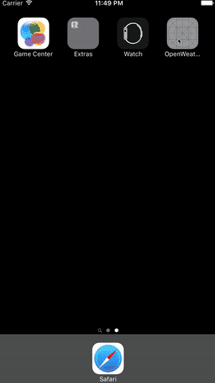

# OpenWeatherMap



A sample project that uses the OpenWeatherMap API in order to show the weather

For more information about the OpenWeatherMap API used, please see [here](http://www.openweathermap.org/forecast5)

# How to run

In order to run this project, you first need to set your own Open Weather Map API Key, in the file `GlobalConfiguration`:

```
    static let OpenWeatherMapAPIKey = "<API KEY>"
```

Failing to do so will trigger an assertion at the time a request is made:

```
assertion failed: 

-----> PLEASE SET YOUR API KEY <-----

: file <your-path>/OpenWeatherMap/OpenWeatherMap-Sample/Helpers/Network/NSURL+OpenWeatherMapAdditions.swift, 

line 13
```

Once an API Key is set up, the project should execute successfully.

Bear in mind that it was decided to use the API with geographic coordinates, so please **accept** the request to the User Location permission when you first launch the app.

Failing to do so will result in **unexpected behaviour**, as error handling was not implemented due to shortage of time.

# How to run tests

In order to run the unit tests for this project, choose `Test` under `Project`, or execute `CMD+U`, when the main target is selected.

This project contains a simple set of tests against the created Parser and Model.

This could easily be further extended to the rest of the components used in this application.


# Further Improvements

- Persistence layer (e.g. Core Data) to allow to see the weather while offline
- Support multiple places (e.g. use `UserDefaults` to persist the ones added, allow to search for places)
- Proper error handling
	- Handle the case where the user does not allow access to the User's Location
	- Handle invalid data/http error codes
- Better unit test coverage
- Allow to press on each card in order to access further information (e.g. sea level, humidity, etc)
- Pull to refresh
- Allow the user to re-order cards

